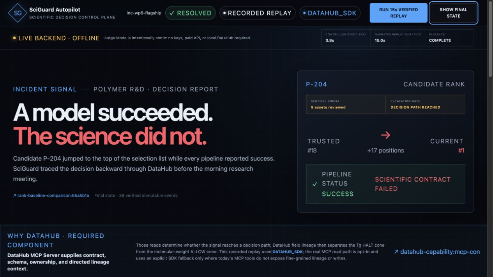

# SciGuard

**A domain-configurable trust agent for scientific data and ML, powered by DataHub.**
SciGuard uses DataHub's schemas, lineage, ownership and governance to catch a silent
upstream data change, trace every affected model and research output, score the risk with
configurable domain rules, and write trusted context back to the catalog — demonstrated on
a polymer materials R&D pipeline.

Built for **Build with DataHub: The Agent Hackathon 2026**. Apache-2.0. No confidential or
unpublished research data is used — all data is synthetic and reproducible.

## Judge Mode (public, no login)

Anonymous Judge Mode: <https://sciguard-autopilot-demo.pages.dev/>

The current ChatGPT-hosted product URL is workspace-gated by the hosting platform even
though the application route itself does not require identity. P0 therefore includes an
independent, static Judge Mode build under `web/judge-dist`:

- no login, secret, local DataHub, backend, or paid API is required at runtime;
- the browser verifies the bundled JSONL against its manifest SHA-256, event count,
  contiguous sequence, unique event IDs, and single incident before rendering;
- one click runs a fixed 15-second narrated replay over the original immutable events;
- **38 immutable events: 35 events reach recovery lock, followed by 3 verified recovery events.**
- the logged-in/full product remains intact and can still connect to the bounded live API;
- hosted asset nodes open public read-only evidence receipts; a local DataHub deep link is
  shown only when the full product itself is running on localhost.

Build it with `cd web && pnpm build:judge`, then publish the contents of `judge-dist/` to
any anonymous static host. Deployment is intentionally not performed by this repository.



The bundled SHA-256 is an integrity and internal-consistency check. Because the expected
digest and JSONL ship together, it is not a digital signature, independent source
authentication, or proof of origin.

## The problem

Scientific and ML pipelines break *silently* when upstream data changes:

- a glass-transition temperature `Tg` is reported in Kelvin instead of Celsius,
- a molecular-weight unit flips `g/mol` → `kg/mol`,
- a sample identifier or `SMILES` column is dropped, an instrument protocol changes.

The numbers stay plausible, so nothing errors. The model keeps predicting, the report keeps
ranking candidates — on quietly corrupted inputs. And there is usually no traceability from
raw experiment → cleaned data → features → model → research decision, so no one can answer
"if this changed, what downstream is now wrong, and who owns it?"

## What SciGuard does

One continuous incident workflow — lightweight signal detection, bounded investigation,
deterministic control, and evidence-gated recovery — with DataHub as the context and action
layer. An optional narration layer can explain frozen decisions but cannot change them:


```text
scientific-data change
  → Sentinel          : diff schema/units, map a conservative scope, decide whether to escalate
  → Coordinator       : open fixed hypotheses and dispatch two independent evidence paths
  → field proof       : isolate the contaminated branch and prove the preserved branch
  → Policy Guardian   : choose HALT/WARN/ALLOW deterministically from YAML policy
  → Enforcer          : block execution/publication and persist incident controls to DataHub
  → Recovery          : resume only after fresh evidence passes the configured gate
```

`api/runtime.py` is the only composition root. Sentinel never writes controls, the UI never
recomputes policy, and Streamlit/CLI are thin clients of the same Event API. See the
[code map](docs/code_map.md) for the complete main trunk and authority boundaries.

## Why DataHub — measured, not asserted

DataHub is the lineage graph that connects a raw experiment to the model and report it
silently breaks. The current regression evaluation compares exact lineage traversal with a
search-only DataHub baseline that has no dependency direction:

| approach | precision | recall | F1 | exact cone |
|---|---|---|---|---|
| **WITH DataHub lineage** | **100%** | **100%** | **100%** | **3/3** |
| SEARCH-ONLY DataHub (without lineage) | 60% | 83.3% | 69.8% | 0/3 |

Catalog search has no sense of direction and misses assets whose names do not resemble the
query; only lineage recovers every exact downstream cone. Both numbers are produced by real
runs. Evaluation 2.0 will add a third mode that performs no DataHub calls at all.

## Results

`python evaluation/harness.py` scores 13 labelled scenarios (9 actionable + 4 negative
controls) against the live catalog and **fails (non-zero exit) if any metric regresses**:

- change-detection accuracy: **100%**
- risk-severity accuracy: **100%**
- false-alarm rate on benign changes: **0%**
- impacted-entity precision / recall: **100% / 100%**
- owner-notification precision / recall: **100% / 100%**
- model control targeting: **100%**

This is a controlled synthetic benchmark; its purpose is regression safety, false-alarm
control, and the DataHub ablation — not a claim of real-world accuracy.

## How DataHub is used

- **Schema + units** — units live as dataset custom properties; the detector diffs them.
- **Multi-hop lineage** — `searchAcrossLineage` recovers the full downstream impact cone.
- **Field lineage** — proves that `tg_degC` enters the Tg branch but not the molecular-weight
  branch.
- **Ownership** — every affected entity's owner is resolved, so the right people are notified.
- **Governance context** — criticality, role, model version and synthetic-data tags make
  policy inputs visible and queryable.
- **Governance write-back** — incident-scoped `AT_RISK` / `QUARANTINED` / `RESOLVED`
  controls and evidence references are written back, always read-modify-write so existing
  catalog metadata is never clobbered.
- **Configurable domain profiles** — rules are YAML (`generic → materials → polymer`), so a
  new scientific domain is a config change, not a code change.
- **DataHub MCP Server** — schema, unit contract, directed dataset lineage, ownership, and
  governance reads run through real MCP tools with `SCIGUARD_USE_MCP=1`. These inputs
  determine whether the signal reaches a decision path. The current MCP tools do not expose
  DataHub's fine-grained lineage aspect or metadata writes, so the MCP runtime explicitly
  uses the SDK for field-level branch proof and write-back. Live parity tests verify every
  claimed MCP read against the SDK; the curated replay honestly identifies its capture
  backend as `DATAHUB_SDK`.
- **Safe optional narration** — an LLM receives bounded metadata and evidence IDs, never raw
  rows. Pydantic rejects extra authority fields, tool requests are limited to registered
  DataHub reads, and provider failure or unsafe output selects a deterministic fallback.

## Demo scenario

A deterministic synthetic polymer pipeline with a contaminated and preserved branch:

```text
instrument_batch_B042 → raw_polymer_experiments → cleaned_polymer_dataset
                                                   ├→ tg_feature_table
                                                   │  ├→ tg_prediction_model
                                                   │  │  └→ candidate_ranking_report
                                                   │  └→ exploratory_dashboard
                                                   └→ molecular_weight_feature_table
                                                      └→ durability_model
                                                         └→ formulation_report
```

Firmware `v4.2` emits exactly 187 rows of batch `B042` in Kelvin while the deployed
normalizer still assumes Celsius. Every pipeline reports success, but candidate `P-204`
moves from rank #18 to #1. Field lineage establishes that the molecular-weight branch does
not consume Tg and can remain available while the Tg decision path is investigated.

## Local setup

Prerequisites: Python 3.10–3.12, `uv`, Node.js 22.13.0 or newer, Corepack/pnpm, Docker
Desktop (or Docker Engine with Compose v2), at least 8 GB memory allocated to Docker, and
13 GB free disk space.

```bash
conda create --prefix ./.venv python=3.11 -y
conda activate "$PWD/.venv"
python -m pip install --upgrade pip wheel setuptools
python -m pip install -e '.[dev]'
cp .env.example .env
datahub docker quickstart
DATAHUB_GMS_URL=http://localhost:8080 datahub datapack load showcase-ecommerce
pytest
```

After activating the environment, the equivalent convenience commands are `make check`,
`make datahub-up`, and `make datahub-sample`.

Open <http://localhost:9002> and sign in with the local Quickstart defaults
`datahub` / `datahub`. These credentials are for local development only. The default local
Quickstart has metadata-service authentication disabled, so the sample loader connects
directly to GMS and does not create an access token.

See [docs/development.md](docs/development.md) for verified environment details.

## Run the demo, incident and evaluation

Seed the synthetic polymer lineage graph into DataHub, then run the CLI, API, evaluation,
or fallback UI:

```bash
python -m pip install -e '.[api,app,mcp]'               # FastAPI + Streamlit + MCP client
uv tool install mcp-server-datahub@latest               # the DataHub MCP Server
PYTHONPATH=. python data/synthetic_polymer/generate.py
PYTHONPATH=. python data/synthetic_polymer/ingest_to_datahub.py
PYTHONPATH=. uvicorn api.main:app --host 127.0.0.1 --port 8000  # one runtime + Event API
PYTHONPATH=. python examples/run_incident.py            # thin CLI client of that runtime
PYTHONPATH=. python -m examples.publish_candidate_report \
  --source data/synthetic_polymer/candidate_ranking_after.csv \
  --target examples/outputs/published_candidate_ranking.csv   # exit 42 while blocked
PYTHONPATH=. python evaluation/harness.py               # metrics + DataHub ablation
cd web && pnpm install --frozen-lockfile && pnpm dev     # primary command center
pnpm build:judge                                        # anonymous static Judge Mode
PYTHONPATH=. streamlit run app/streamlit_app.py         # emergency fallback UI

# Or start the same API with DataHub MCP reads instead of SDK reads:
SCIGUARD_USE_MCP=1 PYTHONPATH=. uvicorn api.main:app --host 127.0.0.1 --port 8000
```

For a reproducible Web install, use:

```bash
cd web
corepack enable
pnpm install --frozen-lockfile
```

`web/.openai/hosting.json` is a local, ignored binding file. Neither build requires it:
the full product builds with no D1/R2 bindings when it is absent, and Judge Mode never
reads it. `web/.openai/hosting.example.json` documents the optional shape without exposing
the real hosted project binding.

Run the complete Python and Web verification suite from the repository root:

```bash
python -m pip install -e '.[api,app,dev,mcp]'
python -m pytest
python -m ruff check .
(cd web && corepack enable && pnpm install --frozen-lockfile && pnpm lint && pnpm test)
```

The bounded API exposes only health, live run/state/events, evidence-gated recovery,
incident-scoped reset, and recorded replay. Start a live flagship run with
`POST /api/runs`; stream `/api/runs/{incident_id}/events` as SSE. The curated real-run
fallback is available at `/api/replays/inc-wp6-flagship` and is always labelled
`RECORDED_REPLAY`. Its manifest records provenance and an event-file SHA-256.

The command center opens in verified recorded-replay mode and remains fully demonstrable
without a live API. When the API is healthy, the full product can stream the same immutable
Event schema over SSE. Evidence links expose the facts behind every key number. Hosted
DataHub graph nodes open public receipts rather than broken localhost links; local catalog
deep links appear only in a local full-product session. The console shows the real exit 42 /
exit 0 publication outcomes. See [docs/evaluation.md](docs/evaluation.md) for the metrics and
[docs/architecture.md](docs/architecture.md) for the design.

Source cleanliness and replay provenance are separate facts. A clean checkout can build
the Judge artifact without changing tracked files, while the current immutable replay
retains its original manifest disclosure (`source_worktree_dirty: true`) and source commit.
It is not relabelled or regenerated merely to make the repository appear clean.

## Repository layout

```text
app/                         thin Streamlit fallback client (no business decisions)
api/                         sole runtime composition root, Event API, SSE and Run Store
web/                         full command center + independent static Judge Mode + public replay
core/                        Sentinel, investigation, impact, policy, enforcement and recovery
security/                    prompt redaction, bounded context and read-only tool gate
datahub_client/              DataHub metadata readers and writers
domain_profiles/             generic, materials and polymer rules (YAML)
data/synthetic_polymer/      synthetic data generator + DataHub ingest
evaluation/                  labelled scenarios, metrics and gated harness
examples/                    incident inputs and curated outputs
tests/                       automated tests
docs/                        architecture, evaluation and development notes
```

## License

Apache License 2.0. See [LICENSE](LICENSE).
