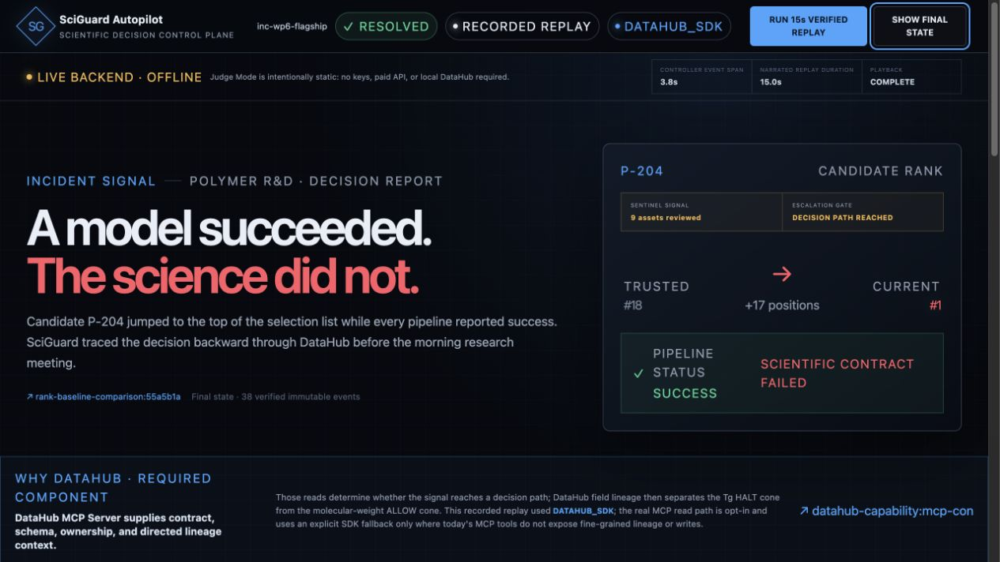

# SciGuard

**A domain-configurable trust agent for scientific data and ML, powered by DataHub.**
SciGuard uses DataHub's schemas, lineage, ownership and governance to catch a silent
upstream data change, trace every affected model and research output, score the risk with
configurable domain rules, and write trusted context back to the catalog — demonstrated on
a polymer materials R&D pipeline.

Built for **Build with DataHub: The Agent Hackathon 2026**. Apache-2.0. No confidential or
unpublished research data is used — all data is synthetic and reproducible.

## Judge Mode (public, no login)

Live Judge Mode: <https://sciguard-autopilot-demo.pages.dev/>

The anonymous Cloudflare Pages release offers two explicit paths:

- **RUN LIVE SCIENTIFIC INCIDENT** creates an isolated, fixed Kelvin/Celsius incident in
  the public Cloudflare Worker, performs a new 187-row calculation, traverses a verified
  DataHub read-back snapshot, evaluates policy, generates a repair plan, and streams
  enforcement events over SSE;
- **WATCH VERIFIED CHAMPION RUN** serves the canonical
  `inc-sciguard-b042-unit-contract` closure. Its Evidence Center exposes the DataHub
  read-back, measured evaluation, and GitHub PR/CI receipts from that same incident.

The live edge sandbox is deliberately read-only. It reuses the canonical PR #2 receipt,
never creates anonymous GitHub actions, accepts no arbitrary repository or scenario, keeps
per-run state in a Durable Object, and allows three runs per browser session per ten
minutes. Its DataHub input is labelled
`VERIFIED_DATAHUB_READBACK_SNAPSHOT`: the calculation is live, while the public sandbox
does not claim that a fresh GMS query occurred.

The current ChatGPT-hosted product URL is workspace-gated by the hosting platform even
though the application route itself does not require identity. P0 therefore includes an
independent, static Judge Mode build under `web/judge-dist`:

- no login, browser secret, local DataHub, or paid API is required at runtime;
- the browser verifies the bundled JSONL against its manifest SHA-256, event count,
  contiguous sequence, unique event IDs, and single incident before rendering;
- one click runs a fixed 15-second narrated replay over the immutable canonical events;
- **55 immutable events bind one live DataHub incident, one exact repair revision, and two
  fresh recovery-verification executions from detection through `RESOLVED`;**
- the same `inc-sciguard-b042-unit-contract` execution contains the real GitHub PR, three
  hosted GitHub Actions checks, demo-signed owner review, `APPLIED` synthetic-staging receipt,
  two-clean-run recovery gate, native Incident, and published Decision Log;
- its live DataHub closure receipt reads back 19 native Production ML entities; the repair
  manifest and bundle cross-bind the event SHA, DataHub receipt digest, lifecycle, and
  receipt IDs;
- the Counterfactual Verification Lab renders trusted rank `#18`, contaminated rank `#1`,
  and verified repaired rank `#18` from executed receipts, alongside the unchanged safe
  branch digest;
- the canonical capture reports `remote PR: true`, `DEMO_SIGNED_NOT_SSO`, and
  `production authorization: false`; the PR, CI, approval, application and recovery
  receipts all bind the same exact commit;
- a public GitHub evidence receipt records an account-bound review without mislabelling it
  as independent enterprise SSO/OIDC approval;
- the logged-in/full product remains intact and can still connect to the bounded live API;
- hosted asset nodes open public read-only evidence receipts; a local DataHub deep link is
  shown only when the full product itself is running on localhost.

Build it with `cd web && pnpm build:judge`. Verify the public Worker with
`pnpm verify:live`, then publish only `judge-dist/` to an anonymous static host. A release
is accepted only after both the bounded live contract and the public canonical
replay/repair package pass.



The bundled SHA-256 is an integrity and internal-consistency check. Because the expected
digest and JSONL ship together, it is not a digital signature, independent source
authentication, or proof of origin.

## The problem

Scientific and ML pipelines break *silently* when upstream data changes:

- a glass-transition temperature `Tg` is reported in Kelvin instead of Celsius,
- a molecular-weight unit flips `g/mol` → `kg/mol`,
- a sample identifier or `SMILES` column is dropped, an instrument protocol changes.

The numbers stay plausible, so nothing errors. The model keeps predicting, the report keeps
ranking candidates — on quietly corrupted inputs. And there is usually no traceability from
raw experiment → cleaned data → features → model → research decision, so no one can answer
"if this changed, what downstream is now wrong, and who owns it?"

## What SciGuard does

One continuous incident workflow — lightweight signal detection, bounded investigation,
deterministic control, and evidence-gated recovery — with DataHub as the context and action
layer. An optional narration layer can explain frozen decisions but cannot change them:


```text
scientific-data change
  → Sentinel          : diff schema/units, map a conservative scope, decide whether to escalate
  → Coordinator       : open fixed hypotheses and dispatch two independent evidence paths
  → field proof       : isolate the contaminated branch and prove the preserved branch
  → Policy Guardian   : choose HALT/WARN/ALLOW deterministically from YAML policy
  → Repair Planner    : produce an evidence-bound patch, tests, rollback and approval gate
  → Enforcer          : block execution/publication and persist incident controls to DataHub
  → Applicator        : materialize the approved exact Git tree in isolated synthetic staging
  → Recovery          : re-run exact-commit evidence and resume only after the configured gate
```

`api/runtime.py` is the only composition root. Sentinel never writes controls, the UI never
recomputes policy, and Streamlit/CLI are thin clients of the same Event API. See the
[code map](docs/code_map.md) for the complete main trunk and authority boundaries.

## Why DataHub — measured, not asserted

DataHub is the lineage graph that connects a raw experiment to the model and report it
silently breaks. The current regression evaluation compares exact lineage traversal with a
search-only DataHub baseline that has no dependency direction:

| approach | precision | recall | F1 | exact cone |
|---|---|---|---|---|
| **WITH DataHub lineage** | **100%** | **100%** | **100%** | **3/3** |
| SEARCH-ONLY DataHub (without lineage) | 60% | 100% | 75% | 0/3 |
| NO DataHub (zero-context abstention) | N/A · 0 predictions | 0% | 0% | 0/3 |

Catalog search has no sense of direction and misses assets whose names do not resemble the
query; only lineage recovers every exact downstream cone. The third arm receives no backend
object and makes zero catalog calls; it abstains rather than fabricating dependency or owner
context. All three outputs are computed by the harness rather than hardcoded. The Judge UI
reads the reviewed machine artifact at
[`examples/outputs/evaluation_report.json`](examples/outputs/evaluation_report.json), which
is mirrored to `web/public/evidence/evaluation_report.json`.

## Results

`PYTHONPATH=. python evaluation/harness.py` scores 13 labelled scenarios (9 actionable + 4 negative
controls) against the live catalog and **fails (non-zero exit) if any metric regresses**:

- change-detection accuracy: **100%**
- risk-severity accuracy: **100%**
- false-alarm rate on benign changes: **0%**
- impacted-entity precision / recall: **100% / 100%**
- owner-notification precision / recall: **100% / 100%**
- model control targeting: **100%**

This is a controlled synthetic benchmark; its purpose is regression safety, false-alarm
control, and the DataHub ablation — not a claim of real-world accuracy.

## How DataHub is used

- **Schema + units** — units live as dataset custom properties; the detector diffs them.
- **Multi-hop lineage** — `searchAcrossLineage` recovers the full downstream impact cone.
- **Field lineage** — proves that `tg_degC` enters the Tg branch but not the molecular-weight
  branch.
- **Native Production ML graph** — the ingest emits MLFeature, MLFeatureTable,
  MLModelGroup, versioned MLModel, MLModelDeployment, training-run, and inference-run
  entities. Linked dataset projections retain field schemas and fine-grained lineage.
- **Ownership** — every affected entity's owner is resolved, so the right people are notified.
- **Governance context** — criticality, role, model version and synthetic-data tags make
  policy inputs visible and queryable.
- **Governance write-back** — incident-scoped `AT_RISK` / `QUARANTINED` / `RESOLVED`
  controls and evidence references are written back, always read-modify-write so existing
  catalog metadata is never clobbered.
- **Native Incident + Decision Log** — a DataHub Incident spans the server-supported
  dataset projections of the scientific decision cone, while a published DataHub Document
  records the full root cause, native model/deployment/process context, repair, approval,
  and evidence closure; recovery resolves the same Incident and updates the same log.
  DataHub GMS 1.5 cannot attach process/deployment URNs directly to these aspects, so those
  links are retained in inspectable document properties rather than silently omitted.
- **Configurable domain profiles** — rules are YAML (`generic → materials → polymer`), so a
  new scientific domain is a config change, not a code change.
- **Portable DataHub Skills** — `skills/` contains scientific impact analysis,
  proof-carrying repair review, and recovery certification skills following the official
  Agent Skills structure, with concise output contracts and tested authority boundaries.
- **DataHub MCP Server** — schema, unit contract, directed dataset lineage, ownership, and
  governance reads run through real MCP tools with `SCIGUARD_USE_MCP=1`. These inputs
  determine whether the signal reaches a decision path. The current MCP tools do not expose
  DataHub's fine-grained lineage aspect or metadata writes, so the MCP runtime explicitly
  uses the SDK for field-level branch proof and write-back. Live parity tests verify every
  claimed MCP read against the SDK; the curated replay honestly identifies its capture
  backend as `DATAHUB_SDK`.
- **Safe optional narration** — an LLM receives bounded metadata and evidence IDs, never raw
  rows. Pydantic rejects extra authority fields, tool requests are limited to registered
  DataHub reads, and provider failure or unsafe output selects a deterministic fallback.

## Demo scenario

A deterministic synthetic polymer pipeline with a contaminated and preserved branch:

```text
instrument_batch_B042 → raw_polymer_experiments → cleaned_polymer_dataset
                                                   ├→ tg_feature_table
                                                   │  ├→ tg_prediction_model
                                                   │  │  └→ candidate_ranking_report
                                                   │  └→ exploratory_dashboard
                                                   └→ molecular_weight_feature_table
                                                      └→ durability_model
                                                         └→ formulation_report
```

Firmware `v4.2` emits exactly 187 rows of batch `B042` in Kelvin while the deployed
normalizer still assumes Celsius. Every pipeline reports success, but candidate `P-204`
moves from rank #18 to #1. Field lineage establishes that the molecular-weight branch does
not consume Tg and can remain available while the Tg decision path is investigated.

## Local setup

Prerequisites: Python 3.10–3.12, `uv`, Node.js 22.13.0 or newer, Corepack/pnpm, Docker
Desktop (or Docker Engine with Compose v2), at least 8 GB memory allocated to Docker, and
13 GB free disk space.

```bash
conda create --prefix ./.venv python=3.11 -y
conda activate "$PWD/.venv"
python -m pip install --upgrade pip wheel setuptools
python -m pip install -e '.[api,dev,mcp]'
cp .env.example .env
datahub docker quickstart
DATAHUB_GMS_URL=http://localhost:8080 datahub datapack load showcase-ecommerce
pytest
```

After activating the environment, the equivalent convenience commands are `make check`,
`make datahub-up`, and `make datahub-sample`.

Open <http://localhost:9002> and sign in with the local Quickstart defaults
`datahub` / `datahub`. These credentials are for local development only. The default local
Quickstart has metadata-service authentication disabled, so the sample loader connects
directly to GMS and does not create an access token.

See [docs/development.md](docs/development.md) for verified environment details.

## Run the demo, incident and evaluation

Seed the synthetic polymer lineage graph into DataHub, then run the CLI, API, evaluation,
or fallback UI:

```bash
python -m pip install -e '.[api,app,mcp]'               # FastAPI + Streamlit + MCP client
uv tool install mcp-server-datahub@latest               # the DataHub MCP Server
PYTHONPATH=. python data/synthetic_polymer/generate.py
PYTHONPATH=. python data/synthetic_polymer/ingest_to_datahub.py
PYTHONPATH=. python scripts/bootstrap_repair_sandbox.py
PYTHONPATH=. python scripts/capture_canonical_run.py      # canonical 55-event closure
PYTHONPATH=. uvicorn api.main:app --host 127.0.0.1 --port 8000  # one runtime + Event API
PYTHONPATH=. python examples/run_incident.py            # thin CLI client of that runtime
PYTHONPATH=. python -m examples.publish_candidate_report \
  --source data/synthetic_polymer/candidate_ranking_after.csv \
  --target examples/outputs/published_candidate_ranking.csv   # exit 42 while blocked
PYTHONPATH=. python evaluation/harness.py               # metrics + DataHub ablation
cd web && pnpm install --frozen-lockfile && pnpm dev     # primary command center
pnpm build:judge                                        # anonymous static Judge Mode
PYTHONPATH=. streamlit run app/streamlit_app.py         # emergency fallback UI

# Or start the same API with DataHub MCP reads instead of SDK reads:
SCIGUARD_USE_MCP=1 PYTHONPATH=. uvicorn api.main:app --host 127.0.0.1 --port 8000
```

For a reproducible Web install, use:

```bash
cd web
corepack enable
pnpm install --frozen-lockfile
```

`web/.openai/hosting.json` is a local, ignored binding file. Neither build requires it:
the full product builds with no D1/R2 bindings when it is absent, and Judge Mode never
reads it. `web/.openai/hosting.example.json` documents the optional shape without exposing
the real hosted project binding.

Run the complete Python and Web verification suite from the repository root:

```bash
python -m pip install -e '.[api,app,dev,mcp]'
python -m pytest
python -m ruff check .
(cd web && corepack enable && pnpm install --frozen-lockfile && pnpm lint && pnpm test)
```

The bounded API exposes health, live run/state/events, proof-carrying repair actions,
evidence-gated recovery, incident-scoped reset, and recorded replay. Start a live flagship run with
`POST /api/runs`; stream `/api/runs/{incident_id}/events` as SSE. The curated real-run
fallback is available at `/api/replays/inc-sciguard-b042-unit-contract` and is always labelled
`RECORDED_REPLAY`. Its manifest records provenance and an event-file SHA-256.

After root cause and field impact are proven,
`GET /api/runs/{incident_id}/repair` returns the deterministic Repair Bundle: proposed
patch, unit-contract test, P-204 decision regression, preserved-branch non-regression,
rollback, native model/deployment context, evidence closure, and a locked owner approval
gate. The action sequence is:

```text
POST /api/runs/{id}/repair/publish   -> real GitHub PR + exact-commit receipt
POST /api/runs/{id}/repair/verify    -> three hosted B042 Check Run receipts
POST /api/runs/{id}/repair/approval  -> commit-bound signed review receipt
POST /api/runs/{id}/repair/apply     -> exact approved tree in isolated synthetic staging
POST /api/runs/{id}/recovery         -> server re-runs exact-commit checks; caller cannot submit PASS
```

Application is a separate, fail-closed lifecycle boundary: only an `APPROVED` bundle whose
change, verification, and approval receipts all name the same commit can reach `APPLIED`.
The local implementation reads that commit with `git archive`, rejects unsafe archive
entries, materializes it outside the source repository, and records a canonical tree digest.
Its receipt is deliberately labelled `LOCAL_STAGING`, target
`SCIGUARD_SYNTHETIC_STAGING`, and `production_authorized: false`; it is not a production
deployment claim.

Recovery is unavailable before `APPLIED`. Its request cannot contain check results.
SciGuard re-executes the locked verifier (or re-reads GitHub Check Runs) on the published
commit, maps the exact declared check set into fresh recovery evidence, and rejects
incident-ID mismatches before changing DataHub state. A demo-signed approval remains useful
audit evidence but cannot shorten the default requirement for two consecutive clean runs.

Run `make canonical-prepare` to generate and push the deterministic repair branch, then
open the printed compare URL and create the PR with the exact printed title and body.
After the hosted checks and account-bound review exist, `make canonical-capture` re-reads
the public GitHub state and records it inside the same canonical incident. The
`enterprise_sso_verified` and `production_authorized` fields remain `false`; SSO/OIDC-backed
production approval is a deliberately unclaimed boundary.

The checked-in canonical receipt was read back from a real local DataHub Quickstart GMS
`v1.5.0.6` with CLI `1.6.0.15`. In the same
`inc-sciguard-b042-unit-contract` execution it verifies
19 native entities:
7 MLFeatures, 2 MLFeatureTables, 2 MLModelGroups, 2 MLModels, 2 MLModelDeployments,
and 4 training/inference DataProcessInstances. It also records the exact repair revision,
verification, review, synthetic-staging application, two fresh recovery executions, native
Incident `ACTIVE → RESOLVED` lifecycle, and published Decision Log. The public receipt
names the capture location without embedding an unusable localhost URL.

To use a dedicated GitHub repair sandbox instead of the local adapter, inject both values
from a secret manager:

```bash
SCIGUARD_GITHUB_REPOSITORY=owner/sciguard-repair-sandbox
SCIGUARD_GITHUB_TOKEN=...  # fine-grained token for that repository only
```

The repair target must match the configured repository and base branch exactly. The
included pull-request workflow has read-only contents permission and publishes three stable
Check Run names. Do not put the token in `.env`, logs, replay artifacts, or the browser.

The command center opens in verified recorded-replay mode and remains fully demonstrable
without a live API. When the API is healthy, the full product can stream the same immutable
Event schema over SSE. Evidence links expose the facts behind every key number. Hosted
DataHub graph nodes open public receipts rather than broken localhost links; local catalog
deep links appear only in a local full-product session. The console shows the real exit 42 /
exit 0 publication outcomes. See [docs/evaluation.md](docs/evaluation.md) for the metrics and
[docs/architecture.md](docs/architecture.md) for the design.

The checked `inc-sciguard-b042-unit-contract` artifact is the clean-source canonical capture:
55 contiguous events, one incident ID, an `APPLIED` Repair Bundle, two fresh
recovery-verification executions, final `RESOLVED`, and 19 native entities. Its replay
manifest, repair manifest, and DataHub closure receipt all record
`source_worktree_dirty: false`. Reproduce that gate with:

```bash
make canonical-capture-clean
# equivalent:
PYTHONPATH=. python scripts/capture_canonical_run.py --require-clean
```

The command fails closed unless the worktree is clean and rewrites all three
provenance-bearing artifacts from the same source commit. Then run
`make verify-public URL=...` to compare deployed bytes. The deployment
verifier does not establish source cleanliness by itself; both gates are required.
The generated evidence is committed as the release wrapper; record both the
capture-source SHA and final release-tag SHA; do not create an impossible recursive
recapture loop merely because committing evidence creates a newer release commit.

The older `inc-wp6-flagship` 38-event replay and its later linked action capture remain
available only as legacy development evidence. They are no longer the Judge Mode default
and must not be combined with the canonical release run to support a submission claim.

## Repository layout

```text
app/                         thin Streamlit fallback client (no business decisions)
api/                         sole runtime composition root, Event API, SSE and Run Store
web/                         full command center + independent static Judge Mode + public replay
core/                        Sentinel, investigation, policy, repair, application, enforcement and recovery
security/                    prompt redaction, bounded context and read-only tool gate
datahub_client/              DataHub metadata readers and writers
domain_profiles/             generic, materials and polymer rules (YAML)
data/synthetic_polymer/      synthetic data generator + DataHub ingest
evaluation/                  labelled scenarios, metrics and gated harness
examples/                    incident inputs and curated outputs
scripts/                     canonical capture, public verification and local bootstrap tools
tests/                       automated tests
docs/                        architecture, evaluation, release execution and development notes
```

## License

Apache License 2.0. See [LICENSE](LICENSE).
