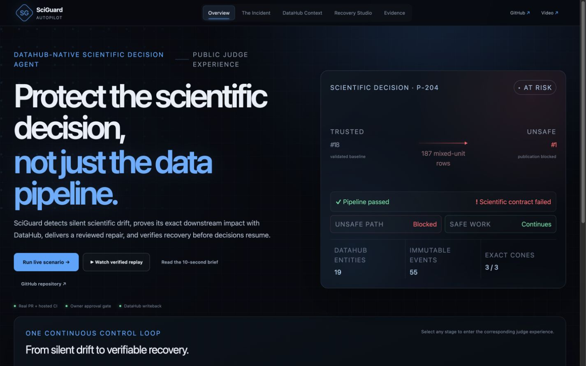
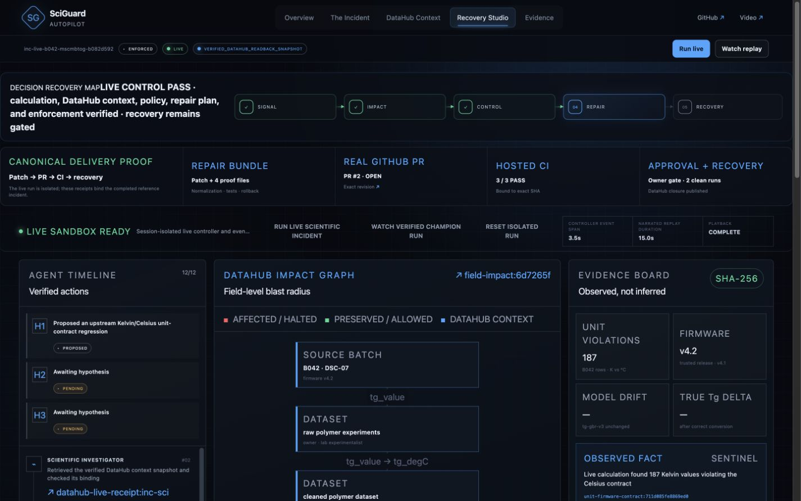
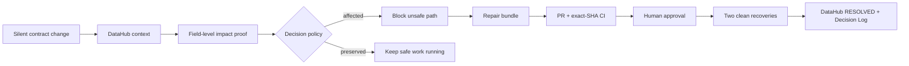

<div align="center">

# SciGuard Autopilot

### Protect the scientific decision—not just the data pipeline.

**A DataHub-native agent that detects silent scientific data failures, isolates only the unsafe decision path, ships an evidence-bound repair, verifies recovery, and writes closure back to the graph.**

[](https://github.com/songjie6816-code/sciguard-autopilot/actions/workflows/ci.yml)
[](https://github.com/songjie6816-code/sciguard-autopilot/actions/workflows/judge-health.yml)
[](https://github.com/songjie6816-code/sciguard-autopilot/releases/tag/v1.0.0-hackathon)
[](LICENSE)

**[Run the live scenario](https://sciguard-autopilot-demo.pages.dev/)** ·
**[Inspect the Evidence Center](https://sciguard-autopilot-demo.pages.dev/#evidence)** ·
**[Open the real repair PR](https://github.com/songjie6816-code/sciguard-repair-sandbox/pull/2)** ·
**[View the frozen release](https://github.com/songjie6816-code/sciguard-autopilot/releases/tag/v1.0.0-hackathon)**

</div>

> **Pipeline: PASS. Scientific decision: FAIL.** A silent Kelvin/Celsius contract change moved candidate **P-204 from trusted rank #18 to unsafe rank #1**. SciGuard used DataHub field lineage to block only the contaminated Tg decision, kept the independent molecular-weight branch running, delivered a reviewed repair with **3/3 hosted checks**, verified two clean recoveries, and wrote `RESOLVED` back to DataHub.



Built for **Build with DataHub: The Agent Hackathon 2026**. All scientific data is synthetic and reproducible; no confidential or unpublished research data is used.

## Judge it in 90 seconds

No account, local DataHub instance, or secret is required for the public path.

| Time | What to inspect | Direct proof |
|---:|---|---|
| 0–10s | Pipeline passed, but a scientific decision failed | [Live Judge Mode](https://sciguard-autopilot-demo.pages.dev/) |
| 10–25s | DataHub identifies the affected Tg path and preserves the unrelated MW path | [Decision Graph](https://sciguard-autopilot-demo.pages.dev/#context) · [DataHub receipt](examples/outputs/datahub_live_receipt.json) |
| 25–45s | The agent generates a patch, tests, rollback, and approval gate | [Repair Bundle](web/public/replays/inc-sciguard-b042-unit-contract/repair-bundle.json) |
| 45–60s | The exact repair revision is delivered and verified | [Real PR #2](https://github.com/songjie6816-code/sciguard-repair-sandbox/pull/2) · [3 hosted Check Runs](examples/outputs/github_live_evidence.json) |
| 60–75s | Unsafe work stays blocked; safe work continues | [Operate view](https://sciguard-autopilot-demo.pages.dev/#studio) |
| 75–90s | Two clean recoveries resolve the incident and publish a Decision Log | [Evidence Center](https://sciguard-autopilot-demo.pages.dev/#evidence) · [live DataHub read-back](examples/outputs/datahub_live_receipt.json) |

The canonical incident is `inc-sciguard-b042-unit-contract`. Its 55-event replay, repair bundle, GitHub receipt, evaluation, and DataHub read-back cross-bind the same incident and exact repair SHA `ea1a4760520fcb299d8b8f73d955e5c66cc03ee3`.



## Why SciGuard is different

| Typical monitoring or catalog feature | SciGuard |
|---|---|
| Alerts that a pipeline failed | Detects when the pipeline **passes but the scientific decision is wrong** |
| Stops an entire downstream system | Uses field lineage to block the contaminated branch and preserve safe work |
| Suggests a fix in chat | Produces a reviewable patch, regression tests, rollback plan, real PR, and exact-SHA CI |
| Treats approval as a button | Binds approval, application, and recovery receipts to one immutable commit |
| Closes an incident in a separate tool | Writes the final state, evidence references, native Incident, and Decision Log back to DataHub |
| Claims the graph is useful | Measures DataHub lineage against search-only and zero-context ablations |

SciGuard composes DataHub capabilities rather than rebuilding a catalog. DataHub supplies the context graph, ownership, governance, native Production ML entities, Incidents, Documents, MCP reads, and write-back surface; SciGuard adds scientific contract reasoning, branch-selective control, proof-carrying repair, and evidence-gated recovery.

## The control loop


```mermaid
flowchart LR
    A[Silent contract change] --> B[DataHub context]
    B --> C[Field-level impact proof]
    C --> D{Decision policy}
    D -->|affected| E[Block unsafe path]
    D -->|preserved| F[Keep safe work running]
    E --> G[Repair bundle]
    G --> H[PR + exact-SHA CI]
    H --> I[Human approval]
    I --> J[Two clean recoveries]
    J --> K[DataHub RESOLVED + Decision Log]
```

The authority boundary is explicit: the detector cannot write controls, the UI cannot recompute policy, and optional LLM narration cannot change a deterministic decision. `api/runtime.py` is the single composition root. See the [architecture](docs/architecture.md) and [code map](docs/code_map.md).

## Why DataHub is indispensable

The incident begins with 187 plausible rows from firmware `v4.2`: Kelvin values reach a normalizer that still assumes Celsius. Every pipeline job succeeds, yet P-204 moves from #18 to #1. Dataset names alone cannot establish which decisions consume `tg_degC` or which work is independent.

DataHub provides the directed, governed context required to act safely:

- schema and scientific unit contracts through dataset metadata;
- multi-hop and fine-grained lineage from experiment to feature, model, report, and dashboard;
- ownership, criticality, model release, deployment, and run context;
- seven native Production ML roles across 19 verified entities;
- native Incident and Decision Log lifecycle;
- MCP-backed supported reads and labelled SDK fallback for fine-grained lineage/write-back;
- governance write-back for `AT_RISK`, `QUARANTINED`, and `RESOLVED` state.

### Measured three-arm ablation

The checked-in [machine-readable evaluation](examples/outputs/evaluation_report.json) is generated by the harness, mirrored to the Judge UI, and guarded against regression.

| Context arm | Precision | Recall | F1 | Exact impact cones |
|---|---:|---:|---:|---:|
| **DataHub directed lineage** | **100%** | **100%** | **100%** | **3/3** |
| DataHub search only, no lineage | 60% | 100% | 75% | 0/3 |
| No DataHub | N/A—abstains | 0% | 0% | 0/3 |

The benchmark contains 13 labelled synthetic scenarios: nine actionable changes and four negative controls. It reports 100% change detection, risk severity, and control targeting with a 0% false-alarm rate. These are controlled regression results—not claims of real-world accuracy.

## One incident, inspectable end to end

```text
SIGNAL       Firmware v4.2 silently changes Tg from Celsius to Kelvin
IMPACT       DataHub traces tg_degC → feature → model → P-204 ranking
CONTROL      Tg decision path blocked; molecular-weight path preserved
REPAIR       Patch + unit test + rank regression + safe-branch test + rollback
DELIVERY     Real GitHub PR #2; 3/3 hosted checks at one exact commit
APPROVAL     Owner review required; demo-signed identity is labelled, not overstated
RECOVERY     Two fresh clean executions; caller cannot submit its own PASS result
WRITE-BACK   DataHub Incident RESOLVED; Decision Log PUBLISHED with receipt IDs
```

The public Evidence Center exposes the source behind each headline number. The canonical proof package includes:

- [55-event replay manifest](web/public/replays/inc-sciguard-b042-unit-contract/manifest.json) with event-file SHA-256;
- [repair manifest](web/public/replays/inc-sciguard-b042-unit-contract/repair-manifest.json) and [repair bundle](web/public/replays/inc-sciguard-b042-unit-contract/repair-bundle.json);
- [GitHub PR, review, and hosted-CI receipt](examples/outputs/github_live_evidence.json);
- [live DataHub end-to-end read-back](examples/outputs/datahub_live_receipt.json);
- [evaluation report](examples/outputs/evaluation_report.json);
- [frozen release notes](docs/MODULE5_RELEASE_FREEZE.md).

## Live, recorded, and deliberately unclaimed

| Surface | What is live | What is recorded or bounded |
|---|---|---|
| **Run Live Scientific Incident** | New isolated 187-row calculation, policy execution, repair plan, enforcement events, and SSE stream in a Cloudflare Worker | Traverses a verified DataHub read-back snapshot; reuses the canonical PR receipt and never performs anonymous GitHub mutations |
| **Watch Verified Champion Run** | Browser-side integrity checks and interactive replay | Immutable 55-event canonical closure captured from real DataHub and GitHub executions |
| **Local full stack** | Fresh DataHub MCP/SDK reads, write-back, GitHub adapter, API, SSE, and clients | Requires the operator's local services and credentials |

Honesty boundaries:

- The public sandbox does **not** claim a fresh GMS query for each anonymous run.
- The public review is GitHub-account-bound but **not** independent enterprise SSO/OIDC approval.
- The exact tree was applied to isolated synthetic staging; `production_authorized` remains `false`.
- A bundled SHA-256 proves internal consistency, not independent origin or digital signature.
- The DataHub Skills contribution is a submitted draft, not an accepted upstream feature.

## Try it

### Fastest path

Open the [public demo](https://sciguard-autopilot-demo.pages.dev/) and choose **Run Live Scientific Incident**. When a gate needs human action, the interface explains exactly what to review and provides the next action. **Watch Verified Champion Run** remains available as an immutable fallback.

### Reproduce the repository gate

Prerequisites: Python 3.10–3.12 and Node.js 22.13+ with Corepack/pnpm.

```bash
git clone https://github.com/songjie6816-code/sciguard-autopilot.git
cd sciguard-autopilot
python3 -m venv .venv
.venv/bin/python -m pip install --upgrade pip wheel setuptools
.venv/bin/python -m pip install -e '.[api,dev,mcp]'
corepack enable
make judge-check PYTHON=.venv/bin/python
```

`make judge-check` runs Python lint/tests, regenerates and compares the evaluation artifact, installs the locked Web dependencies, lints the UI, and runs the browser-independent Web/Judge contract suite.

### Run the local product

```bash
make api PYTHON=.venv/bin/python
cd web
pnpm dev
```

For fresh DataHub ingestion, MCP mode, the synthetic graph, and canonical evidence capture, follow [development.md](docs/development.md). The verified environment uses DataHub Quickstart GMS `v1.5.0.6` and CLI `1.6.0.15`.

## Architecture


```text
DataHub schema / field lineage / ownership / governance / Production ML
                              │
                       Sentinel + Coordinator
                              │
              deterministic Policy Guardian
                     ┌────────┴────────┐
              affected path      preserved path
              HALT + repair       continue + prove
                     └────────┬────────┘
               exact-SHA PR / CI / approval / recovery
                              │
                 DataHub Incident + Decision Log
```

Primary implementation surfaces:

| Area | Location |
|---|---|
| Runtime and Event API | [`api/runtime.py`](api/runtime.py), [`api/main.py`](api/main.py) |
| Detection, policy, control, repair, recovery | [`core/`](core) |
| DataHub graph, MCP, native ML, Incident/Document write-back | [`datahub_client/`](datahub_client), [`data/synthetic_polymer/`](data/synthetic_polymer) |
| React Judge product | [`web/`](web) |
| Deterministic evaluation | [`evaluation/`](evaluation), [`examples/outputs/`](examples/outputs) |
| Portable DataHub Skills | [`skills/`](skills) |
| Tests and CI | [`tests/`](tests), [`.github/workflows/`](.github/workflows) |

## Safety and engineering guarantees

- deterministic policy and fail-closed evidence gates;
- per-incident control state—no global block flag;
- explicit affected, preserved, and unknown impact partitions;
- read-modify-write metadata updates that preserve unrelated catalog properties;
- exact-commit binding across change, CI, approval, application, and recovery receipts;
- caller cannot supply recovery PASS results;
- fixed synthetic staging target and archive path validation;
- optional narration is schema-constrained and loses authority on failure;
- recorded replay and sample data are labelled at the source and in the UI.

## Open-source contribution

The reusable `affected / preserved / unknown` field-impact contract is proposed in [datahub-project/datahub-skills issue #82](https://github.com/datahub-project/datahub-skills/issues/82) and implemented in [draft PR #83](https://github.com/datahub-project/datahub-skills/pull/83). The repository also contains three portable DataHub Skills with tested authority and output contracts.

Contributions are welcome; see [CONTRIBUTING.md](CONTRIBUTING.md). Security and evidence-integrity reports follow [SECURITY.md](SECURITY.md).

## License and disclosures

Apache License 2.0—see [LICENSE](LICENSE). External components are listed in [THIRD_PARTY_NOTICES.md](THIRD_PARTY_NOTICES.md), and synthetic-data methodology is documented under [`data/synthetic_polymer/`](data/synthetic_polymer). Use of DataHub follows its applicable license; DataHub is a trademark of its respective owner.
