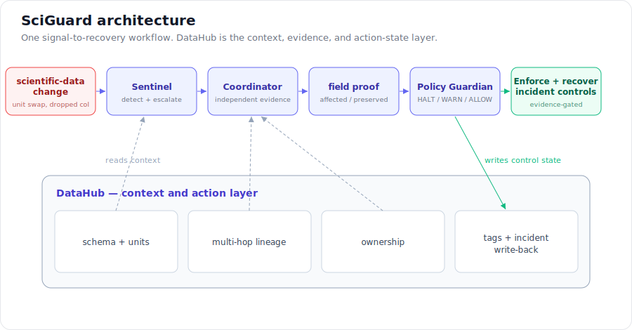

# Architecture

SciGuard is a single agent built from deterministic tools. DataHub is the context and
action layer; the `core` package is fully testable without an LLM, which keeps the loop
reproducible and directly measurable.



## Components

- `datahub_client/metadata_reader.py` — reads schema, per-field units (custom properties),
  ownership, and multi-hop downstream lineage (`searchAcrossLineage`, paginated).
- `datahub_client/metadata_writer.py` — writes tags and incident properties back to DataHub.
  Every write is read-modify-write on the *whole* aspect, so existing metadata is preserved.
- `core/change_detector.py` — diffs two metadata snapshots into structured `Change` events
  (unit change, field added/removed, type change).
- `core/profiles.py` — loads YAML domain profiles with an `extends` chain
  (`generic → materials → polymer`) and matches rules to changes by whole-token field names.
- `core/lineage_analyzer.py` — turns a change site into the affected downstream cone with
  roles and owners; also provides the no-lineage search baseline used in the ablation.
- `core/risk_engine.py` — matches changes to rules and aggregates a worst-case severity.
- `core/remediation.py` — assembles a remediation plan and a Markdown incident report.

## Loop

```text
scientific-data change
  → change detector   (reads schema + units from DataHub)
  → lineage analyzer  (reads multi-hop lineage + ownership from DataHub)
  → risk engine       (matches configurable domain-profile rules)
  → remediation       (plan + incident report)
  → write-back        (model-at-risk tag + incident summary to DataHub)
```

## Design choices

- **Deterministic core, optional LLM.** All correctness-bearing logic is rule-based, so
  results are reproducible and testable. An LLM layer can narrate reports without changing
  the decisions.
- **Configurable, not hard-coded.** Domain knowledge lives in YAML profiles; a new domain
  (batteries, catalysis) is a config change.
- **Never clobber.** Write-backs merge into existing aspects so SciGuard is safe to run
  against a shared catalog.
