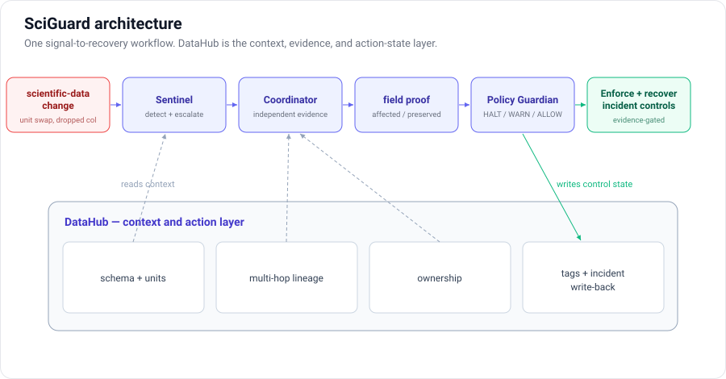

# Architecture

The public implementation map is `docs/code_map.md`. This document describes the frozen
WP0 protocol and the current architecture; later work packages must extend it without
weakening its deterministic decision path.

SciGuard Autopilot has one operational story and one composition root. A lightweight
Sentinel turns metadata drift into a typed signal and escalates only when the configured
severity and decision-path gates are met. The same incident then flows through bounded
investigation, field-level impact proof, deterministic policy, enforcement,
exact-revision application, and recovery.
DataHub remains the context, evidence, coordination, and action-state layer. Safety
decisions remain deterministic and fully testable without an LLM.



## Frozen product protocol (WP0)

The machine-readable contract and flagship ground truth live at the top of
`evaluation/scenarios.json` under `contract` and `flagship`. Implementations must import or
validate against that contract rather than defining competing names in API, UI, or replay
code.

### Distinct enums

These concepts are intentionally separate:

| concept | values | meaning |
|---|---|---|
| `IncidentState` | `HEALTHY`, `DETECTED`, `INVESTIGATING`, `AT_RISK`, `QUARANTINED`, `RECOVERY_PENDING`, `RESOLVED` | lifecycle of one incident |
| `PolicyDecision` | `HALT`, `WARN`, `ALLOW` | deterministic decision for one asset |
| `CatalogStatus` | `HEALTHY`, `AT_RISK`, `QUARANTINED`, `RESOLVED` | state written to DataHub |
| `EnforcementAction` | `QUARANTINE`, `BLOCK_EXECUTION`, `BLOCK_PUBLISH`, `WRITE_BACK`, `NOTIFY`, `RESUME` | concrete side effect performed by an adapter |
| `Criticality` | `LOW`, `MEDIUM`, `HIGH`, `CRITICAL` | business/scientific importance, not incident severity |

For example, `candidate_ranking_report` receives policy decision `HALT`, catalog status
`AT_RISK`, and enforcement action `BLOCK_PUBLISH`. These are not aliases.

### Incident lifecycle

```text
HEALTHY -> DETECTED -> INVESTIGATING -> AT_RISK -------> RECOVERY_PENDING -> RESOLVED
                                  \-> QUARANTINED ----/
```

Investigation may resolve a benign incident directly. `AT_RISK` may escalate to
`QUARANTINED`. A failed recovery check returns to `AT_RISK` or `QUARANTINED`; `RESOLVED` is
terminal for an incident ID. A recurrence creates a new incident ID.

### Event envelope

Every persisted or streamed event has all of the following fields:

```text
event_id, incident_id, sequence, timestamp, actor, event_type,
summary, evidence_ids, duration_ms, payload
```

`sequence` provides deterministic replay order. `timestamp` is RFC3339 UTC.
`evidence_ids` references separately inspectable evidence; it must not contain raw rows.
`duration_ms` measures the represented operation and must never be fabricated. `payload`
is event-type-specific structured data. WP2 implements this frozen envelope with Pydantic,
strict legal transitions, atomic JSONL persistence, and replay validation.

### Truth labels

- `LIVE` means the current execution produced the shown evidence and action against the
  current dependencies.
- `RECORDED_REPLAY` means immutable events captured from a prior real execution.
- Only the bounded `LocalPipelineController` may be claimed as controlled. SciGuard does
  not claim Airflow, dbt, or production-scheduler control.
- All demo rows are deterministic synthetic data.
- An LLM may narrate validated evidence but cannot choose `HALT`, `ALLOW`, or `RESUME`.

## Flagship data and lineage graph (WP1)

The deterministic generator creates 420 synthetic candidates. Batch B042 has 240 rows;
firmware v4.2 emits exactly 187 Tg measurements in Kelvin while the deployed v1 normalizer
still labels every value as Celsius. P-204 is deterministically ranked #18 in the trusted
baseline and #1 in the corrupted successful output.

```text
instrument_batch_B042 -> raw_polymer_experiments -> cleaned_polymer_dataset
                                                   |-> tg_feature_table
                                                   |   |-> tg_prediction_model
                                                   |   |   `-> candidate_ranking_report
                                                   |   `-> exploratory_dashboard
                                                   `-> molecular_weight_feature_table
                                                       `-> durability_model
                                                           `-> formulation_report
```

DataHub stores dataset-level lineage for graph traversal and fine-grained field lineage for
branch proof. `tg_degC` maps into `tg_feature_table`; no Tg field maps into
`molecular_weight_feature_table`. Every node also has owner, criticality, role, schema,
synthetic/role tags, and relevant version properties.

SciGuard now uses a deliberate dual projection. Dataset URNs retain MCP-readable schema,
unit contracts, output fields, and fine-grained lineage. In parallel,
`data/synthetic_polymer/native_ml.py` emits native MLFeature, MLFeatureTable,
MLModelGroup, MLModel, MLModelDeployment, training-run, and inference-run entities. Stable
cross-projection URNs connect Production ML lifecycle semantics to the field-level
decision graph. The canonical `inc-sciguard-b042-unit-contract` Quickstart capture proves 19 native
entities, the exact repair lifecycle, two fresh recovery executions, one native Incident,
and one published Decision Log inside the same incident closure. It is not evidence of a
hosted DataHub deployment.

### Required DataHub component and decision effect

SciGuard substantially uses the **DataHub MCP Server** when `SCIGUARD_USE_MCP=1`.
`search`, `get_lineage`, `list_schema_fields`, and `get_entities` supply the scientific
contract, units, directed dependency scope, ownership, and governance context. Those facts
are not decorative metadata: unit drift plus a decision asset in the directed downstream
scope is what crosses the deterministic escalation gate. If either is absent, the same
policy does not open the flagship investigation.

The current MCP tools do not expose the `fineGrainedLineages` aspect or metadata writes.
The MCP runtime therefore uses a named SDK fallback for the field cone and write-back. The
field cone is the direct input to `build_policy_contexts`: assets inside it receive the
role-based HALT/WARN rules, while assets outside it receive ALLOW. Runtime events include a
`datahub_context_provenance` receipt naming the MCP inputs and SDK fallbacks. The canonical
55-event Judge replay honestly declares `DATAHUB_SDK` in its manifest; it is not relabelled
as an MCP capture.

## Components

- `api/main.py` — exposes the bounded health/run/state/SSE, repair lifecycle,
  recovery/reset, and replay surface.
- `api/runtime.py` — the **only composition root**. It wires Sentinel to the deep incident
  workflow and owns the live run, recovery, health, and reset use cases.
- `api/run_store.py` — isolates each incident in an integrity-checked JSON manifest and
  JSONL event stream, with atomic writes and a single-active-run guard.
- `core/sentinel.py` — owns lightweight schema/unit detection, domain-rule triage, typed
  `DetectionSignal`, and the profile-driven escalation decision. It has no write, block,
  root-cause, or recovery authority.
- `core/impact.py` — owns both deliberate levels of impact mapping: broad dataset lineage
  for Sentinel's initial review scope, then fine-grained field lineage for branch proof.
- `core/profiles.py` — loads inherited YAML detection, escalation, action, and recovery
  policies (`generic → materials → polymer`).
- `core/events.py` — validates the frozen Event envelope, creates content-derived evidence
  IDs, and atomically saves/loads ordered JSONL streams.
- `core/incident_state.py` — owns `IncidentRun`, legal lifecycle transitions, and state
  reconstruction. It does not compose investigation or policy services.
- `core/coordinator.py` — binds the Sentinel signal to three fixed, falsifiable hypotheses
  and resolves them only after both independent workers return.
- `core/investigator.py` — uses DataHub only: reverse lineage plus owner, tags, terms,
  assertion history, and current model/code release context.
- `core/reality_checker.py` — uses local trusted/current artifacts only: ranks, row-level
  unit conversion, firmware provenance, and the trusted release manifest.
- `core/investigation_models.py` — typed cases, hypotheses, evidence, degradation,
  resolutions, and root-cause reports shared by the workers.
- `core/policy_engine.py` — maps proven field impact and asset role through YAML policy to
  deterministic `HALT`, `WARN`, or `ALLOW` decisions and concrete actions.
- `core/repair.py` — freezes the evidence-bound patch, contract/scientific/safe-branch
  tests, rollback, native ML context, and accountable-owner approval gate.
- `core/change_provider.py` — applies only safe relative artifacts to an explicit clean Git
  repository, creates a real branch/commit, and never labels it as a remote PR.
- `core/verification.py` — executes only the locked pytest targets without a shell and
  binds exit code, output hash, duration, repository state, and commit to one receipt.
- `core/github_provider.py` — materializes a context-checked unified diff against the exact
  GitHub base commit, then creates blobs, tree, commit, branch, and a bundle-marked PR.
- `core/github_verification.py` — accepts only the latest three required GitHub Check Runs
  whose `head_sha` matches the published repair commit exactly.
- `core/approval.py` — signs a reviewer decision bound to owner, bundle, verification
  receipt, and commit while explicitly separating demo signature from production identity.
- `core/application.py` — materializes only the exact approved Git tree in an isolated
  synthetic-staging release, rejects unsafe archive entries, and records a canonical tree
  digest with `production_authorized: false`.
- `core/enforcement.py` — idempotently persists incident state, evidence references,
  actions, controlled URNs, and status tags to DataHub.
- `core/pipeline_controller.py` — actually blocks local model execution/report publication;
  its dry-run sibling reports the same decision without side effects.
- `core/recovery.py` — re-reads DataHub recovery history on every call and authorizes
  `RESUME` only after the evidence gate succeeds.
- `core/reset.py` — removes only one verified incident's SciGuard-owned metadata.
- `core/narration.py` — creates a sanitized optional narrative after policy is frozen;
  strict validation and deterministic fallback preserve the `PolicyPlan` unchanged.
- `datahub_client/metadata_reader.py` — reads schema, per-field units (custom properties),
  ownership, and multi-hop downstream lineage (`searchAcrossLineage`, paginated).
- `datahub_client/metadata_writer.py` — writes tags and incident properties back to DataHub.
  Every write is read-modify-write on the *whole* aspect, so existing metadata is preserved.
- `security/redactor.py` — recursively removes raw rows and redacts credentials, email,
  and internal URLs before provider calls and again on generated narratives.
- `security/context_builder.py` — builds a metadata-only, size-bounded prompt plus an
  auditable sanitized snapshot and digest; the model receives zero raw data rows.
- `security/policy_gate.py` — accepts only registered DataHub investigation reads and
  rejects writes, shell syntax, internal URLs, unknown tools, and oversized arguments.
- `web/`, `app/streamlit_app.py`, and `examples/run_incident.py` — primary UI and two thin
  fallback clients. They consume the Event API/replay and contain no detector or policy.

For a quicker orientation, see `docs/code_map.md`.

## Loop

```text
scientific-data change
  → Sentinel detects schema/unit drift and maps a conservative downstream review scope
  → escalation policy checks severity + whether a scientific decision path is reached
  → Coordinator opens an incident and binds fixed hypotheses to the signal evidence
  → Investigator (DataHub) + Reality-Checker (local trusted artifacts) cross-check facts
  → field lineage narrows the broad scope into affected and preserved branches
  → deterministic policy freezes HALT/WARN/ALLOW
  → Repair Planner freezes code, tests, rollback, and native Production ML context
  → local action adapter creates a real commit and executes commit-bound verification
  → accountable owner records a signed review; Enforcer applies real controls
  → Applicator materializes the exact approved tree in isolated synthetic staging
  → Recovery re-runs exact-commit evidence after APPLIED

Every stage appends to one validated Event stream. The same stream drives FastAPI, CLI,
Streamlit, the command center, and integrity-checked replay; there is no second workflow.
```

## Bounded reverse investigation (WP3)

The Coordinator receives only the visible symptom (P-204 moved from rank 18 to rank 1
while the pipeline reported success). It does not receive the root cause. It opens three
different contracts:

```text
H1 model/code drift ────────── DataHub current release ─┐
                                                       ├─ Coordinator resolution
H2 upstream data drift ─ DataHub reverse lineage ──────┤
                       └ local unit/firmware check ─────┤
H3 real improvement ─── trusted/current ranks and ─────┘
                        unit-corrected scientific values
```

The Scientific Investigator cannot read the CSV artifacts, and the Reality-Checker does
not call DataHub or copy the Investigator's conclusion. The Coordinator requires both
result objects and the evidence kinds named by each contract. If DataHub or local artifacts
are unavailable, the report is degraded, all hypotheses remain `INCONCLUSIVE`, and the
unavailable-source evidence IDs are retained.

The SDK reads real DataHub assertion associations and run events. The current flagship has
no assertion runs. The current MCP `get_entities` tool does not expose assertion history,
so MCP context explicitly returns `assertions_supported=False`; it never converts “not
observable through this backend” into a passing assertion.

## Deterministic control and recovery (WP4)

The confirmed `tg_value` contamination is propagated through field URNs, not dataset-name
heuristics. It reaches `cleaned_polymer_dataset`, `tg_feature_table`, the Tg model,
dashboard, and candidate ranking. No fine-grained edge carries that field into
`molecular_weight_feature_table`, so the durability/formulation branch remains eligible.

```text
affected + source_batch      → HALT / QUARANTINED / WRITE_BACK
affected + model/report      → HALT / AT_RISK / BLOCK_EXECUTION or BLOCK_PUBLISH
affected + data/dashboard    → WARN / AT_RISK / WRITE_BACK
unaffected (any criticality) → ALLOW / HEALTHY / no enforcement action
```

`LocalPipelineController` is deliberately bounded to local processes and file publication;
it makes no Airflow, dbt, or production scheduler claim. A blocked publish returns process
exit code 42 and does not create the target. `DryRunPipelineController` never executes or
writes.

Policy state is stored in DataHub rather than trusted from process memory. A newly created
Recovery Controller reads the incident ID, controlled URNs, evidence references, and the
full recovery history again. Recovery is rejected unless the Repair Bundle is `APPLIED`.
The checked local applicator is intentionally limited to isolated
`SCIGUARD_SYNTHETIC_STAGING`; its receipt is not production authorization. The API caller
cannot submit check status: the runtime
re-executes the locked local verifier or re-reads hosted Check Runs at the exact published
commit, then requires an exact match with the profile's declared check IDs. Missing/failed
checks and cross-incident state stay locked. Resume requires either two
consecutive complete clean runs, or one complete clean run plus an explicitly
`production_authorized` human approval. A demo-signed, non-SSO receipt remains auditable
but cannot shorten the recovery gate.
An LLM string such as `resume` is recorded as ignored and has no authority. Successful
recovery marks every controlled asset `RESOLVED`, clears blocking actions/risk tags, and
adds the resolved tag.

## Bounded narration boundary (WP5)

The optional model receives a maximum 12,000-character prompt containing sanitized
metadata, evidence IDs, deterministic policy results, and the exact JSON output schema.
It never receives CSV records or event payloads. Prompt snapshots record the sanitized
text, redaction counts, SHA-256 digest, UTC timestamp, and a fixed raw-row count of zero.

Model output can contain only an internal report, a public summary, evidence-linked
hypothesis notes, and proposals for registered read-only investigation tools. Extra fields
such as `decision`, `action`, or `resume` invalidate the entire response. Tool proposals
are validated but not auto-executed by the narration layer; DataHub writes and shell access
are outside its capability boundary. Unknown citations, provider errors, malformed output,
or rejected tools select the deterministic fallback. The original policy plan is returned
unchanged on both paths.

Public and internal narratives are separate fields and both are locally redacted after
generation. This means an email, credential, or internal URL echoed by a model cannot be
published even if the provider ignored its instructions. There is one injectable provider
call boundary and no provider router; correctness does not require any LLM configuration.

## Event API and recorded replay (WP6)

The FastAPI layer does not translate core facts into a second story format. An
`EventRecorder` sidecar persists each frozen `Event` into the incident's JSONL stream as it
is emitted. Both live and replay SSE then wrap that exact object in the same frame:

```text
{ "mode": "LIVE | RECORDED_REPLAY", "event": <core.events.Event> }
```

`mode` is mandatory and global, so a recorded run cannot appear live. SSE supports cursor
reconnection with `Last-Event-ID`; there is no WebSocket transport. One active live run is
allowed per API process, while every incident has its own directory and safe identifier.

The manifest binds its JSONL file by SHA-256 and event count, and records source commit,
dirty-worktree disclosure, UTC timestamps, backend, terminal state, and the stream
validation invariants. Replay validates this metadata plus contiguous sequence, unique IDs,
and single-incident ownership before rendering. Because the expected digest and JSONL ship
together, this is an integrity and internal-consistency check, not a digital signature or
independent source authentication. The primary `inc-sciguard-b042-unit-contract` bundle is an export
of one real 55-event DataHub SDK execution. One incident ID binds Sentinel detection,
investigation, selective enforcement, one local Git revision, locked verification,
demo-signed review, exact-tree synthetic-staging application, two fresh recovery
executions, DataHub Incident resolution, and the final Decision Log. It is not a
hand-authored animation script and does not splice receipts from different runs.

`scripts/capture_canonical_run.py` projects only machine-local repository and Python paths
to stable public labels; receipt IDs, decision fields, and SHA-256 bindings are preserved.
Its replay manifest, repair manifest, Repair Bundle, and live DataHub closure receipt are
written in one capture transaction: replay assets go to both
`examples/replays/inc-sciguard-b042-unit-contract/` and
`web/public/replays/inc-sciguard-b042-unit-contract/`, while the closure receipt goes to
`examples/outputs/` and `web/public/evidence/`.
The checked canonical capture was regenerated from a clean, frozen implementation commit
with `--require-clean` and records `source_worktree_dirty: false` in every
provenance-bearing artifact. The generated evidence is reviewed and committed as the
release wrapper without recursively recapturing it.

The older `inc-wp6-flagship` 38-event replay and its separate local-action capture are
retained only as legacy development evidence. They are not the Judge default and are not
part of the canonical causal proof.

Reset is similarly bounded. It verifies the persisted incident ID, removes only matching
`sciguard:*` properties and known SciGuard status tags from the controlled URNs, preserves
all other DataHub metadata, and deletes only that incident's known manifest/event files.

## Cinematic command center (WP7)

`web/` contains two builds of the same command center and three progressive views:
Brief for the scientific decision, Operate for graph/action work, and Audit for receipts.
The full vinext/Next.js product can connect to the FastAPI SSE endpoint and remains
compatible with the hosting platform's identity layer. `pnpm build:judge` creates an
independent static `judge-dist/` build that requires no login, browser secret, local
DataHub, or paid API. Its public Cloudflare Worker mirrors the bounded Event API contract
for one fixed synthetic scenario. Each run performs a fresh calculation and persists
isolated events in a Durable Object, while DataHub context is explicitly sourced from the
Module 1 verified read-back snapshot. GitHub and DataHub actions remain read-only.
Both modes consume the Event schema directly. Recorded mode verifies the 55-event public bundle's SHA-256, count,
single incident, contiguous sequence, and unique IDs in the browser before rendering.
Playback changes only how many events are visible, so incident state, policy counts,
enforcement outcomes, and recovery never come from a parallel UI state machine.

The surface follows one six-beat story: rank shock, hypotheses, investigation, selective
containment, recovery, and measured proof. Evidence IDs open a shared evidence board.
Hosted lineage nodes open read-only evidence receipts; a localhost DataHub link is rendered
only in a local full-product session. The enforcement console renders the real exit 42 /
exit 0 process results, and the recovery panel is deliberately read-only. The three-mode
evaluation theatre reads the measured lineage, search-only, and zero-context abstention
results from `web/public/evidence/evaluation_report.json`; the zero-context arm makes no
DataHub calls and is not confused with search-only DataHub.

## Design choices

- **Deterministic core, optional LLM.** All correctness-bearing logic is rule-based, so
  results are reproducible and testable. An LLM layer can narrate reports without changing
  the decisions.
- **Configurable, not hard-coded.** Domain knowledge lives in YAML profiles; a new domain
  (batteries, catalysis) is a config change.
- **Never clobber.** Write-backs merge into existing aspects so SciGuard is safe to run
  against a shared catalog.
- **Sidecar observability.** Event recording wraps existing functions and returns their
  original values unchanged. The event stream can therefore power a cinematic UI without
  becoming a second, hidden source of scientific decisions.
